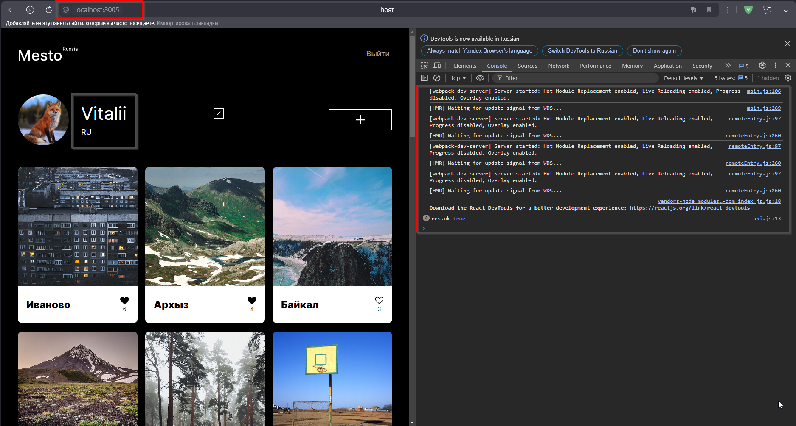

## Задание 1.
```
Разделить проект Mesto на несколько микрофронтендов. Самостоятельно решите, какой фреймворк будете использовать, — Module Federation или Single SPA.
```


Использовал Module Federation т.к. в приложении уже используется React.

Декомпозировал приложение вертикальной нарезкой на следующие микрофронтенды:
   1) Микрофронтенд `Авторизация/Регистрация` 
      Компоненты: 
      - `InfoTooltip.js` - Всплывающие уведомления
      - `Login.js` - Компонент аутентификации пользователя
      - `Register.js` - Компонент регистрации пользователя
      - `AuthContext.js` - Контекст аутентификации пользователя
      - `AuthProvider.js` - Провайдер аутентификации пользователя

   2) Микрофронтенд `Профиль пользователя`
      Компоненты: 
      - `EditAvatarPopup.js` - Всплывающее окно для редактирования аватара
      - `EditProfilePopup.js` - Всплывающее окно для редактирования профиля
      - `PopupWithForm.js` - Компонент всплывающего окна с произвольной формой
      - `Profile.js` - Компонент профиля пользователя

   3) Микрофронтенд `Просмотр/загрузка фотографий`
      Компоненты: 
      - `AddPlacePopup.js` - Всплывающее окно добавления новой фотографии
      - `Card.js` - Компонент отображения карточки с фотографией
      - `CardsContainer.js` - Компонент контейнера карточек
      - `ImagePopup.js` - Всплывающее окно для просмотра фотографии
      - `PopupWithForm.js` - Компонент всплывающего окна с произвольной формой
   
   4) База с хедером и футером.
      Компоненты: 
      - `App.js` - Точка входа в приложение
      - `Main.js` - Основная страница приложения
      - `ProtectedRoute.js` - Компонент маршрутизации

Каждый микрофронтенд отвечает за определенный функционал, не затрагивая логику других приложений.  

Тестирование приложения локально:  
  


## Задание 2. 
[Схема разбиения монолита (google disk)](https://drive.google.com/file/d/1AyGYLf8kd49tVOmOyP_Zpy2j4cB-huQa/view?usp=sharing)  
  
 
1) `Портал электронной площадки` - Основной портал электронной площадки (Фронтенд)  
 
2) `Сервис аутентификации и авторизации` - Выдача JWT токена аутентификации. Обрабатывает обрабатывает запросы аутентификации и авторизации пользователя.

3) `Сервис управления заказами` - Отвечает за бизнес-логику управления заказами. Инициация платежей по заказам.
4) `Сервис управления пользователями` - Отвечает за логику управления пользователями, выдает информацию по пользователям 
5) `Сервис управления аукционами` - Отвечает за бизнес-логику работы аукционов. Инициация создания заказов по завершению аукционов.
6) `Сервис технической поддержки` - Отвечает за сервисные функции сотрудников технической поддержки. Изменение данных заказов и аукционов.
7) `Сервис генерации отчетов` - Отвечает за сбор, хранение и обработку исторических данных по заказам. Генерация отчетов.
8) `Сервис управления апеляциями` - Отвечает за бизнес-логику работы апеляций.
9) `Сервис управления товарами` - Отвечает за хранение данных по товарам.
10) `Сервис управления услугами` - Отвечает за хранение данных по услугам.
11) `Сервис обработки платежей` - Отвечает за создание и обработку платежей.
